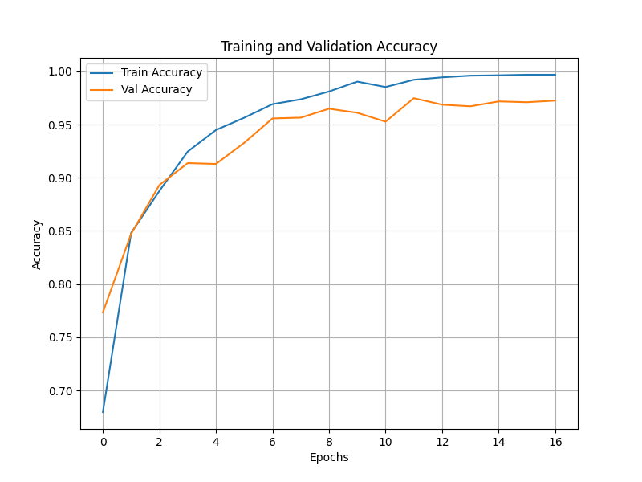
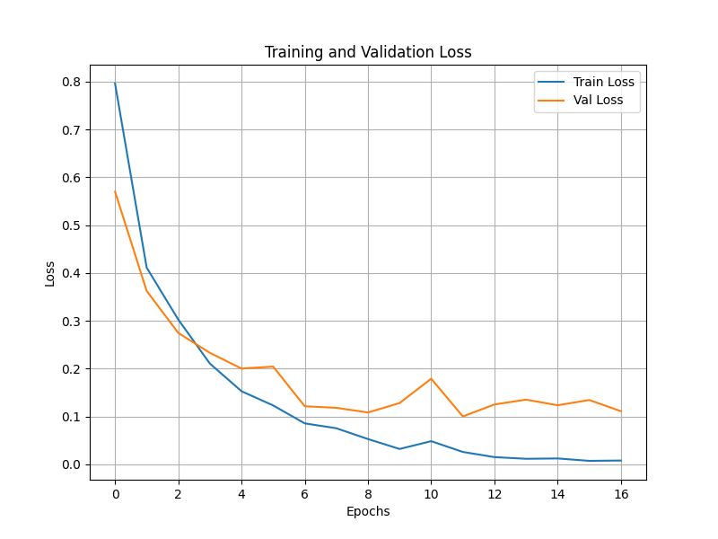
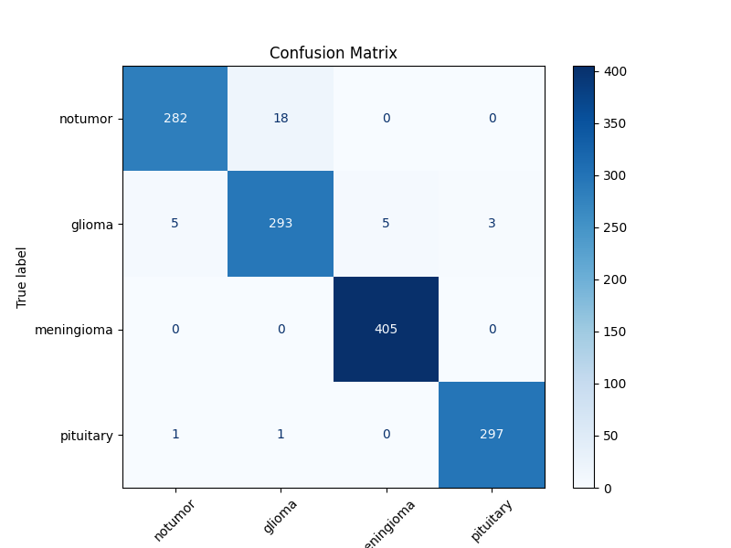
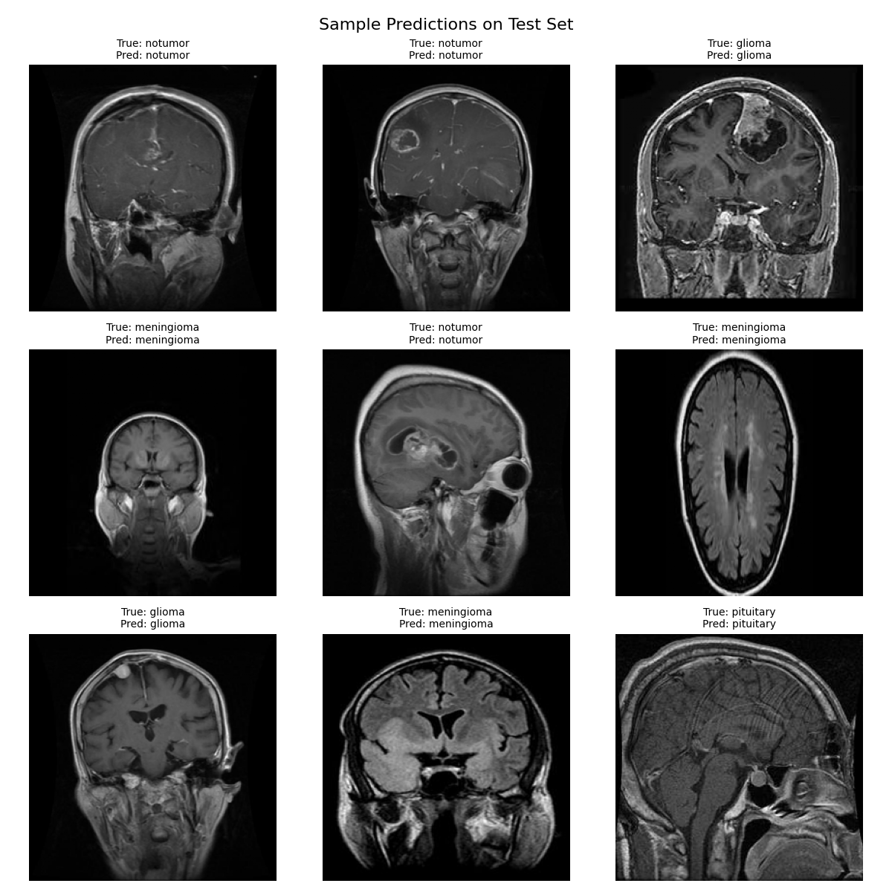

# Brain Tumor MRI Classification Using Deep CNN

A deep learning project for automated brain tumor detection from MRI images using a Convolutional Neural Network (CNN).  
**Author**: Mostafa Mashhadizadeh  
**Affiliation:** Shiraz University of Technology  
**Contact:** mashhadizademostafa@gmail.com

---

## Overview

This project introduces a deep CNN framework for classifying brain tumors from grayscale MRI images into four categories: **no tumor**, **glioma**, **meningioma**, and **pituitary**. The model is trained and evaluated on an open-source dataset and demonstrates strong test accuracy, reflecting the real-world potential of deep learning in medical imaging.

---

## Directory Structure

BrainTumorMRI/

├── src/

│ └── main.py

├── models/

│ ├── BrainTumorClassifier.h5

│ ├── BrainTumorClassifier.onnx

│ └── BrainTumorClassifier.mlpackage

├── outputs/

│ ├── accuracy_plot.png

│ ├── loss_plot.png

│ ├── confusion_matrix.png

│ └── sample_predictions.png

├── requirements.txt

├── LICENSE

└── README.md

---

## Dataset

The dataset used for this project is publicly available, but **cannot be distributed directly through this repository** due to size and copyright constraints.

- **Class structure:** `no tumor`, `glioma`, `meningioma`, `pituitary`
- **Directory format:**
    - `Data/Train/<class_name>/*.jpg`
    - `Data/Test/<class_name>/*.jpg`
- **Note:**  
  Please prepare the MRI image dataset yourself in the `Data/` directory as shown above.  
  Example sources for similar datasets include [Kaggle](https://www.kaggle.com/) and other public research repositories.

If you have any questions regarding dataset preparation, feel free to open an issue or email me.

---

## Model Weights & Large Files

- **.onnx** and **.mlpackage** weights (~60MB each) are included in `models/` (for ONNX/CoreML deployments).
- The original **.h5** file (~170MB) is **not uploaded** because of GitHub's file size limit.  
  If you need it, **open a GitHub issue** or email me: I'll send it to you directly.
- All model conversion steps are inside `src/main.py`.

---

## How to Run

1. **Clone the repository:**
    ```bash cd BrainTumorMRI
    git clone https://github.com/MostafaMashhadi/BrainTumorMRI
    ```

2. **Install dependencies:**
    ```bash cd BrainTumorMRI
    pip install -r requirements.txt
    ```

3. **Prepare the dataset:**
    - Organize images as `Data/Train/<class_name>/` and `Data/Test/<class_name>/`
    - (Optional) Adjust `DATA_DIR` in `src/main.py` if needed

4. **Train & evaluate the model:**
    ```bash cd src
    python main.py
    ```

5. **Outputs:**
    - Trained models: `models/`
    - Visualizations and reports: `outputs/`

---

## Model Architecture

- 3 × Conv2D + MaxPooling
- Flatten → Dense (128 units, dropout)
- Output: Dense Softmax (4 classes)
- Optimizer: Adam
- EarlyStopping & ReduceLROnPlateau for robust training

### Model Summary

<details>
<summary>View Keras Model Summary</summary>
Model: "sequential"
```
_________________________________________________________________
 Layer (type)                Output Shape              Param #
_________________________________________________________________
 conv2d (Conv2D)             (None, 254, 254, 32)      320

 max_pooling2d (MaxPooling2D  (None, 127, 127, 32)     0
 )

 conv2d_1 (Conv2D)           (None, 125, 125, 64)      18496

 max_pooling2d_1 (MaxPooling  (None, 62, 62, 64)       0
 2D)

 conv2d_2 (Conv2D)           (None, 60, 60, 128)       73856

 max_pooling2d_2 (MaxPooling  (None, 30, 30, 128)      0
 2D)

 flatten (Flatten)           (None, 115200)            0

 dense (Dense)               (None, 128)               14745728

 dropout (Dropout)           (None, 128)               0

 dense_1 (Dense)             (None, 4)                 516
_________________________________________________________________
Total params: 14,838,916
Trainable params: 14,838,916
Non-trainable params: 0
_________________________________________________________________
```
</details>

---

## Results

### Training & Validation Accuracy



### Training & Validation Loss



### Confusion Matrix



### Sample Predictions



---

## License

Distributed under the MIT License.  
See [`LICENSE`](LICENSE) for full license text.

---

## Citation

If you use this code or results, please cite:

> Mostafa Mashhadizadeh, *Brain Tumor Detection from MRI with Deep CNN*, Shiraz University of Technology (2024)

---

## Contact

For questions, issues, or **to request model weights**:
- Open a GitHub [issue](https://github.com/MostafaMashhadi/BrainTumorMRI/issues)
- or email: mashhadizademostafa@gmail.com

---

*For more information and in-depth results, refer to the related academic article in the repository.*

